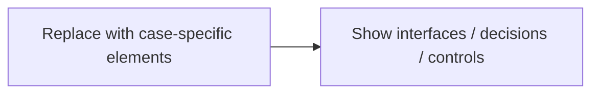

# Deployment Topology

**Case:** Fleet Disruption & Voyage Recovery Intelligence Workbench  
**Stage:** 10 — AI & Application Architecture  
**Participant status:** `TO COMPLETE`  
**Deliverable form:** Diagram + supporting table + rationale

## Stage question
How will the AI-enabled application consume context, integrate, deploy and fail safely?

## Why this artifact exists
This artifact is part of the evidence needed to reach **Complete base AI/application architecture**. It must be consistent with approved upstream artifacts; do not silently redefine earlier facts, semantics, thresholds or decision rights.

## Upstream dependency
Use the completed Stage 09 artifacts and explicitly referenced earlier artifacts. Never copy them into this file simply to satisfy a checklist.

## Evidence to inspect
- `participant_artifacts/09_information_knowledge_and_retrieval_architecture`
- `evidence/04_policy_authority/source_authority.yaml`
- `evidence/04_policy_authority/role_authorization_matrix.csv`
- `evidence/06_evaluations/acceptance_thresholds.yaml`

## Case challenge
Consume Stage 9 through explicit contracts. Keep deterministic policy/authorization outside model discretion and design safe degraded behavior.

## Minimum content
- Environment/node
- Location/region
- Responsibility
- Network/trust zone
- HA/DR
- Identity/secrets

## Relevant non-negotiable constraints
- Cloud/LLM availability must not be required for essential vessel operations.
- Vessel and shore state may diverge during connectivity loss and must reconcile safely on reconnect.
- Duplicate/replayed events must be handled idempotently and with temporal provenance.

## Working scaffold
### Diagram / model

### Supporting decisions
| Element / relationship | Responsibility / meaning | Evidence | Constraint / control |
|---|---|---|---|
| | | | |

## Evidence and traceability
| Claim / decision | Evidence file + record / policy version / scenario | Upstream artifact | Confidence / limitation |
|---|---|---|---|
| | | | |

## Open issues / assumptions
| Issue / assumption | Why unresolved | Owner | Downstream impact | Closure evidence |
|---|---|---|---|---|
| | | | | |

## Completion check
- [ ] Minimum content above is complete.
- [ ] Material claims cite exact evidence or are labelled assumptions.
- [ ] Conflicting/stale evidence is preserved rather than silently resolved.
- [ ] Human, deterministic and AI decision rights are distinguishable where relevant.
- [ ] The artifact does not contradict approved upstream artifacts.
- [ ] `NOT APPLICABLE`, if used, includes rationale, accountable approver and downstream consequence.

## Handoff
**Stage exit contribution:** Complete base AI/application architecture

Do not advance to Stage 11 until the Stage 10 exit gate is defensible.
